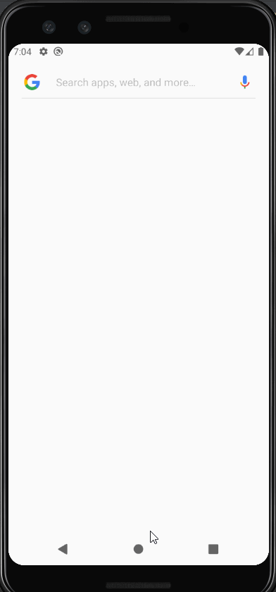

The Parking App 
===


## Table of Contents
1. [Overview](#Overview)
1. [Product Spec](#Product-Spec)
1. [Wireframes](#Wireframes)
2. [Schema](#Schema)

## Overview
### Description
An app that helps find a free parking spot in a parking lot. This app will provide navigation to the the free parking space.

### App Evaluation

- **Category:** Navigation 
- **Mobile:** Uses real time naviagation to direct the user to a free parking space. 
- **Story:** Stop trying to find parking and instead get directions to the nearest available parking 
- **Market:** People traveling to big events can now easily find a parking spot instead of blindly searching for one
- **Habit:** Can be used everytime an individual gets into a car
- **Scope:** Start out by making a functional app that maps one or two parking lots. From here can add more parking lots in the future with more integrated UI and features

## Product Spec

### 1. User Stories (Required and Optional)

**Required Must-have Stories**

* User signup/login
* User selects a destination
* Display driving directions to the parking lot
* Display driving directions to the parking space

**Optional Nice-to-have Stories**

* An expanded selection of parking lots that are mapped


### 2. Screen Archetypes

- [x] Splash Screen
- [x] Shows up everytime user opens the app 
- [x] Login/Registration
- [x] Login screen
- [x] Registration screen
- [x] Selection Screen
- [x] User selects a destination
- [x] Google Maps Screen
- [x] Display driving directions to the parking lot
* Custom Maps Screen
    * Display driving directions to the parking space

### 3. Navigation


**Flow Navigation** (Screen to Screen)

* Splash Screen
* Login Screen
   * Selection Screen
* Registration Screen
    * Selection Screen
* Goolge API Screen
* Custom Maps Screen 
    * Selection Screen 
## Wireframes


## Schema 

### Models
#### Parking Space Model 
| **Property** | **Type** | **Description** |
|:------------:|:--------:|:---------------:|
| Parking Lot |   int   | A unique value to identify each parking lot|
| Parking Space | int | The parking space's number|
| Distance from Entrance | double | Is the distance from the main entrance|
| Longitude | double | Describes the longitude cooridnate|
| Latidude | double | Describes the lattidude coordinate|
| Status | short int | Describes the status of the parking space|
| Type | short int | Describes the type of parking space (Reserved, Handicap, etc)|

Distance to Parking Lot Exit in Feet
=ACOS(COS(RADIANS(90-Exit_Longitude))*COS(RADIANS(90-ParkingSpace_Longitude))+SIN(RADIANS(90-Exit_Longitude))*SIN(RADIANS(90-ParkingSpace_Longitude))*COS(RADIANS(Exit_Latitude-ParkingSpace_Latitude)))*3959*5280

#### Parking Lot Model
| **Propery** | **Type** | **Description** |
|:-----------:|:--------:|:---------------:|
|   Lot Number|   int    | Unique identifier for the parking lot|
| Parking Lot |  string  | The name of the parking lot
| Longitude | double | Describes the longitude cooridnate|
| Latidude | double | Describes the lattidude coordinate|
| Free Space Count | int | Describes the number of free spaces|
| Street Address | string | Describes the address of the individual parking lot|

#### User Model
| **Propery** | **Type** | **Description** |
|:-----------:|:--------:|:---------------:|
|    ID       |  string  | A unique identifier for the user|
| Username    |  string  | The username of the user inside the app|
| Password    |  string  | The password to user's account|
| Email       |  string  | The email of the user|

### Networking
- Login and Registration Screen
  - (Create/POST) Create a new user
  - (Read/GET) Login authentication for a user
 
- Selection of Parking Lots Screen 
  - (Read/GET) Query all selections for parking spaces
      ```swift
         let query = PFQuery(className:"Post")
         query.whereKey("author", equalTo: currentUser)
         query.order(byDescending: "createdAt")
         query.findObjectsInBackground { (posts: [PFObject]?, error: Error?) in
            if let error = error { 
               print(error.localizedDescription)
            } else if let posts = posts {
               print("Successfully retrieved \(posts.count) posts.")
           // TODO: Do something with posts...
            }
         }
         ```

- Google Maps Screen
  - (Read/GET) Get the google maps api to get directions to the destination
  
## Video Walkthrough

Here's a walkthrough of implemented user stories:



GIF created with [ScreenToGif](https://github.com/NickeManarin/ScreenToGif) (https://www.screentogif.com/)..

## Admin Portal 

Here's a screenshot of admin portal, where an admin can mark parking lots available or unavailable.
